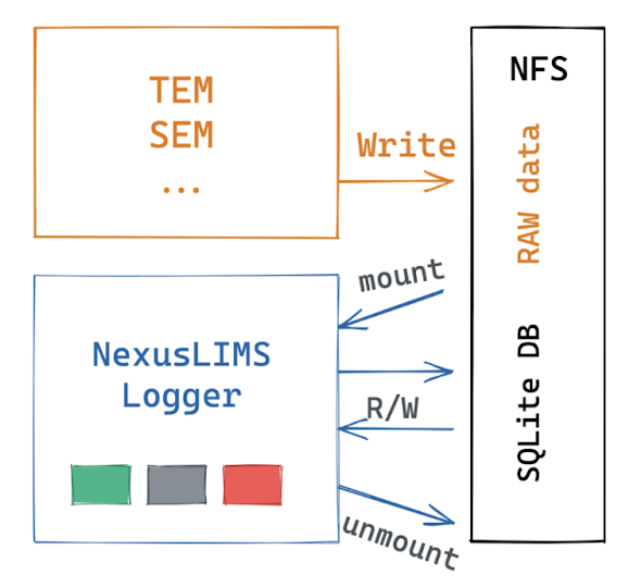
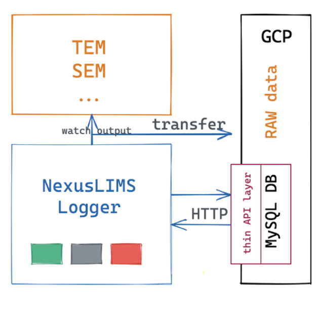

Logger-GUI Versions
=====================

Logger-GUI is the general name for the collection of all Logger versions that were
designed for different deployment scenarios.  Our Logger-GUI versions support deployments
that are completely local, half local half cloud-based (useful when the control computer
only has LAN connections but cloud features are desired by the user), and completely cloud-based
(the control computer has access to the could platform through the World Wide Web).  All
three versions are maintained in the same GitHub repository but reside in different branches 
to avoid confusion.

Logger-local
++++++++++++

Logger-local is designed for groups that are not ready to adopt a cloud platform yet.  This
could be because the EM control computer does not have WWW access, cannot connect through LAN to
a server or computer with WWW access, or the users want the benefit of the Logger-GUI without
having to learn how to compute with cloud platforms.  A schematic of the Logger-local workflow is shown below.

Logger-gcp
++++++++++

Logger-gcp is designed for control PCs that are directly connected to WWW Internet.  This Logger
version was developed with the Google Cloud Platform (gcp), but can be adapted to other cloud platforms
with trivial modifications in the code.  Compared to Logger-local, the Logger-gcp operates with a few main differences;:

   #. The raw data and generated metadata are stored in Cloud Storage, instead of on the Network File Share (NFS)
   #. The ``SQLite`` local database is replaced with ``MySQL`` running on the cloud, which is wrapped with a
      thin layer API using ``Flask``
   #. The Logger-gcp has the additional task of uploading raw data files to the Cloud Storage

The interface of Logger-gcp is identical to the Logger-local.  However, the user is required to authenticate his or herself
upon starting the program with Google authentication in a browser because the Logger-gcp will require written permission
to the cloud storage buckets.  

For more information on installing and setting up the Logger-gcp, click `here <https://nexuslims-logger.readthedocs.io/en/latest/installconfig.html>`_.

 A schematic of the Logger-gcp workflow is shown below.

Logger-EM and Logger-Hub
++++++++++++++++++++++++

For users who desire or require cloud connectivity but possess instrument control PC's that are restricted to local network 
connections, a combination of the two above Logger components has been utilized, reffered to as **Logger-EM** and **Logger-Hub**.
**Logger-EM** is installed and runs on the instrument control PC, which has an identical user interface as the Logger-gcp and 
Logger-local.  **Logger-Hub** is installed and runs on a different computer which is in the same local network as the instrument 
control PC, and must have access to the WWW and thus the Cloud platform.

Logger-Hub needs to be started on the server/VM prior to opening the Logger on the instrument control PC and must be left
open during the entire process.  The minature design of Logger-Hub allows virtually any computer with modern hardware to run
the program.

For security purposes, a service account of the user's project must be created on GCP to be used for authenticatiion.  This 
is because users cannot authenticate using GCP on the instrument control PC without WWW connection.  Only the system admin
needs to manage the cloud account from the computer running the Logger-Hub.  

For more information on installing and setting up the Logger-EM
and Logger-Hub, click `here <https://nexuslims-logger.readthedocs.io/en/logger-hub-dev/>`_.

A schematic of the Logger-Hub workflow is shown below.

..  figure:: _static/logger_hub_workflow.PNG
    :width: 50%
    :align: center
    :alt: Logger-local workflow
    :figclass: align-center
